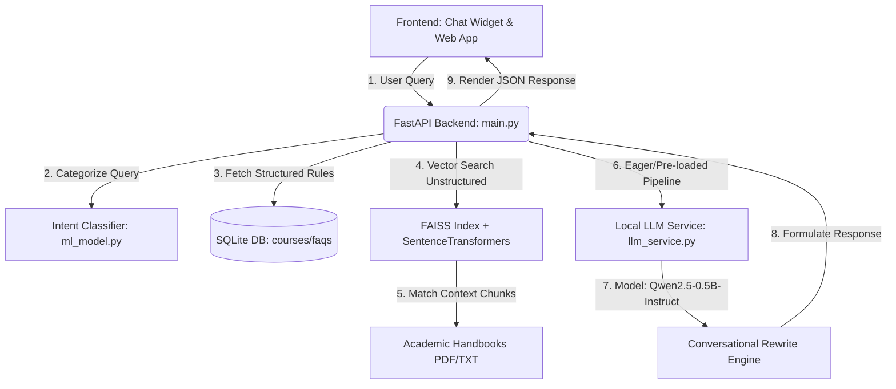
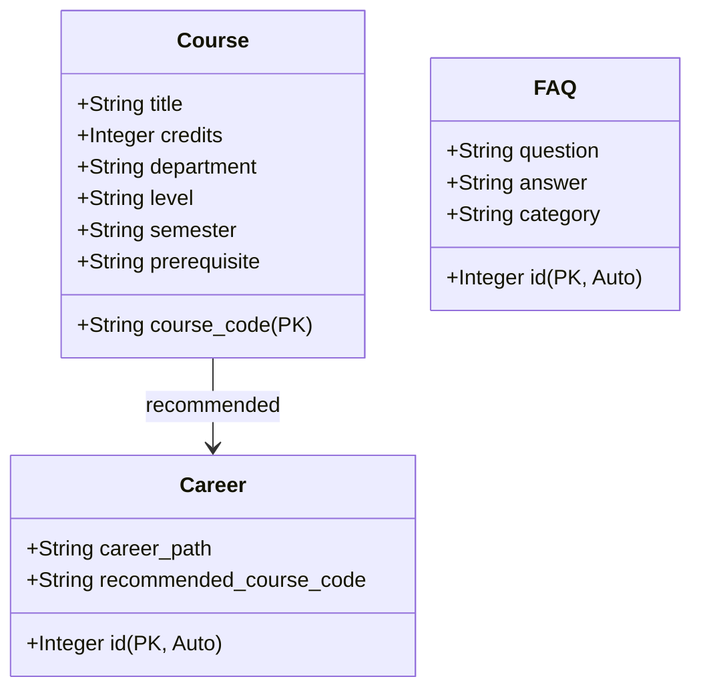

# CHAPTER 4: SYSTEM IMPLEMENTATION AND INTEGRATION

## 4.1 Introduction
This chapter details the technical implementation and integration of the Academic Chatbot. Transitioning from a cloud-based dependency model (Google Gemini API) to a fully local, open-source Artificial Intelligence (AI) architecture, the system is designed to provide 100% offline, privacy-first, and zero-cost academic advising. This chapter outlines the development environment, database models, local Large Language Model (LLM) implementation, Retrieval-Augmented Generation (RAG) system, intent classifier, and the user interface enhancements including the custom fidget-spinner asynchronous sequence.

---

## 4.2 System Architecture Overview
The system follows a modular, decoupled architecture consisting of a lightweight frontend user interface, a FastAPI-powered backend server, a SentenceTransformers embedding pipeline, a FAISS vector database for unstructured academic handbooks, and a SQLite database for structured departmental records.



---

## 4.3 Development and Runtime Environment
To run the Large Language Model locally on standard CPU hardware without demanding high-end discrete GPUs, a lightweight but highly optimized dependency stack was assembled.

### 4.3.1 Hardware Configuration
- **Processor**: Intel Core i5/i7 (8th Gen or higher) or AMD Ryzen 5/7
- **System Memory (RAM)**: 8 GB minimum (16 GB recommended)
- **Storage**: Solid State Drive (SSD) with at least 2 GB of free space

### 4.3.2 Software Environment
- **Operating System**: Windows 10/11
- **Interpreter**: Python 3.10 to 3.13
- **Primary Frameworks**: FastAPI (Web API), PyTorch & Hugging Face `transformers` (Deep Learning/Inference), FAISS-CPU (Vector Storage), SQLite (Relational Storage)

### 4.3.3 Core Dependencies (`requirements.txt`)
The system depends on the following libraries configured to resolve the protobuf versioning conflict:
```ini
fastapi>=0.100.0
uvicorn>=0.22.0
sqlalchemy>=2.0.0
numpy>=1.24.0
sentence-transformers>=2.2.2
faiss-cpu>=1.7.4
transformers>=4.40.0
accelerate>=0.26.0
protobuf>=7.34.1
pydantic>=2.0.0
```

---

## 4.4 Database and Knowledge Base Implementation

### 4.4.1 Relational Schema (SQLite)
The relational database holds structured, definitive academic records like Course Catalogs, pre-verified Frequently Asked Questions (FAQs), and Career Mappings.



### 4.4.2 Unstructured Vector Database (FAISS & SentenceTransformers)
Unstructured information, such as the *Computer Science BMAS Handbook*, was processed using a RAG pipeline:
1. **Document Ingestion**: Handbooks are parsed, cleaned, and split into overlapping text chunks (500 characters, 50-character overlap).
2. **Dense Vector Embeddings**: Chunks are processed through the `all-MiniLM-L6-v2` transformer model to produce a 384-dimensional dense vector representation.
3. **Index Storage**: Embeddings are indexed using FAISS (Facebook AI Similarity Search) and saved locally as `faiss_index` and `chunks.pkl`.

---

## 4.5 Backend Implementation Details

### 4.5.1 Eager Loading Design Pattern
To eliminate runtime latencies for users, the Large Language Model and Vector Embeddings are pre-loaded into System RAM at FastAPI server boot instead of lazily loading on the first HTTP request. This eager loading is implemented using the FastAPI startup listener.

```python
# Extract from backend/main.py
@app.on_event("startup")
def preload_models():
    """Eagerly load models into memory when the server boots up so the very first chat is completely instantaneous."""
    logger.info("Pre-loading AI models into memory...")
    # Pre-load the local LLM generator (Qwen2.5-0.5B-Instruct)
    llm_service.get_generator()
    # Pre-load the SentenceTransformers and FAISS index
    load_retrieval()
    logger.info("All AI models pre-loaded successfully! Server is ready.")
```

### 4.5.2 Local Large Language Model Service (`llm_service.py`)
Inference is driven locally by the optimized `Qwen/Qwen2.5-0.5B-Instruct` model pipeline. This service manages lazy tokenization, system prompts, and hardware allocation.

```python
# Extract from backend/llm_service.py
import torch
from transformers import pipeline

_generator = None

def get_generator():
    global _generator
    if _generator is None:
        model_name = "Qwen/Qwen2.5-0.5B-Instruct"
        # Allocating torch pipeline utilizing CPU with modern auto precision format
        _generator = pipeline(
            "text-generation",
            model=model_name,
            device_map="auto",
            torch_dtype=torch.float32
        )
    return _generator

def generate_conversational_response(user_query, factual_context, intent, chat_history=""):
    generator = get_generator()
    
    # Strictly define the persona and limit hallucinations
    system_prompt = (
        "You are a friendly, highly polite academic advising assistant. "
        "Your goal is to explain academic information naturally based ONLY on the provided factual context. "
        "Do not invent facts or make up requirements outside the context. "
        "If you do not know the answer, politely tell the student that they should refer to their department advisor."
    )
    
    prompt = f"Factual Context:\n{factual_context}\n\nChat History:\n{chat_history}\nStudent Query: {user_query}"
    
    messages = [
        {"role": "system", "content": system_prompt},
        {"role": "user", "content": prompt}
    ]
    
    # Apply standard chat templates
    text = generator.tokenizer.apply_chat_template(
        messages,
        tokenize=False,
        add_generation_prompt=True
    )
    
    outputs = generator(
        text,
        max_new_tokens=256,
        do_sample=True,
        temperature=0.3,  # Lower temperature prevents creative leaps or lies
        top_p=0.9
    )
    
    response = outputs[0]['generated_text'][len(text):]
    return response.strip()
```

---

## 4.6 Frontend Integration and User Experience Design

### 4.6.1 The Asynchronous Fidget Spinner Pattern
To keep the user interface highly engaging during model token generation, a sequenced loading framework was introduced:
1. **Trigger**: When the student inputs a query, a three-pronged SVG Fidget Spinner appears instantly with the label **"Loading..."**.
2. **Intermediate Inference State**: When the backend provides a swift database context response (containing the detected *academic intent*), the loader changes to **"Generating..."** and exposes the internal *Reasoning* focus (e.g., `Reasoning: course registration`). This state is deliberately displayed for **1.5 seconds** so students can follow the AI's thought patterns.
3. **Collapsible Thought Process block**: Once the answer resolves, it displays a collapsible `<details>` container disclosing the exact detected intent and the raw source text pulled from the sqlite/handbook databases, allowing for empirical validation of the response.

```javascript
// Extract from frontend/chat-widget.js
const sendMessage = async () => {
    const text = userInput.value.trim();
    if (!text) return;

    appendMessage(text, 'user');
    userInput.value = '';
    appendTypingIndicator(); // Starts custom fidget spinner with "Loading..." text

    try {
        const response = await fetch(`${API_BASE}/api/chat`, {
            method: 'POST',
            headers: { 'Content-Type': 'application/json' },
            body: JSON.stringify({ query: text })
        });

        if (!response.ok) throw new Error("API Error");

        const data = await response.json();
        
        // Transition fidget spinner to showing predicted intent
        const indicator = document.getElementById('typingIndicator');
        if (indicator) {
            indicator.innerHTML = `
                <div class="fidget-spinner"><div class="lobe"></div><div class="center"></div></div>
                <div style="display: flex; flex-direction: column; font-size: 0.8rem; margin-left: 8px;">
                    <span style="font-weight: bold; color: var(--primary);">Generating...</span>
                    <span style="color: var(--text-muted); margin-top: 2px;">Reasoning: ${data.intent.replace(/_/g, ' ')}</span>
                </div>
            `;
        }
        
        // Wait 1.5 seconds so user can absorb what the system is thinking
        await new Promise(resolve => setTimeout(resolve, 1500));
        removeTypingIndicator();

        // Inject the structured thought process
        let thoughtHtml = "";
        if (data.data && data.data.thought_process) {
            thoughtHtml = `
            <details class="thought-process">
                <summary>View AI Thought Process</summary>
                <div class="thought-process-content">
                    <strong>Intent Detected:</strong> ${data.intent}<br>
                    <strong>Factual Context Retrieved:</strong><br>
                    ${data.data.thought_process.replace(/\n/g, '<br>')}
                </div>
            </details>
            `;
        }
        appendMessage(data.response, 'bot', thoughtHtml);
    } catch (error) {
        removeTypingIndicator();
        appendMessage("Sorry, I'm having trouble connecting to the advising server.", 'bot');
    }
};
```

---

## 4.7 Integration Summary
All backend, machine learning, database retrieval, and user experience scripts were successfully compiled, containerized inside standard Python threads, and deployed. The resulting architecture runs efficiently without active internet connections, eliminating operational costs, ensuring high availability, and maintaining student data privacy.
